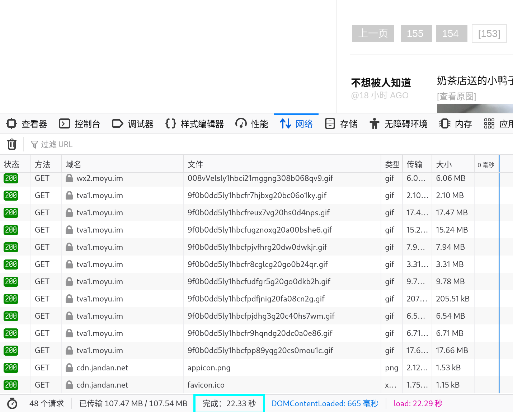
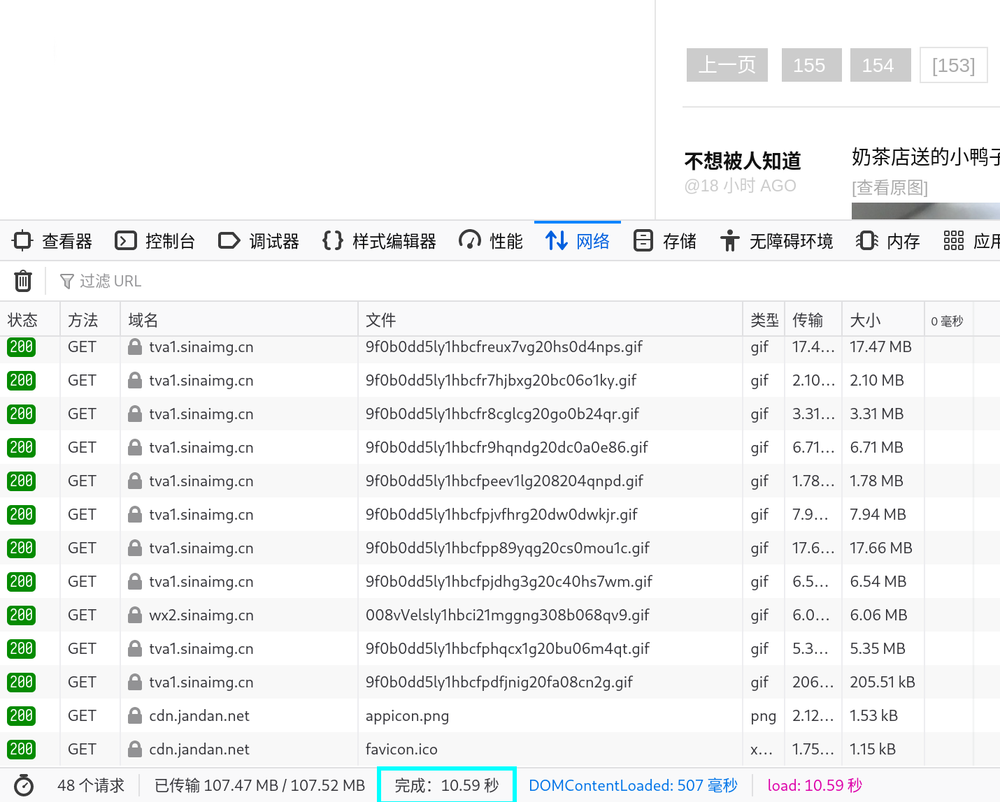
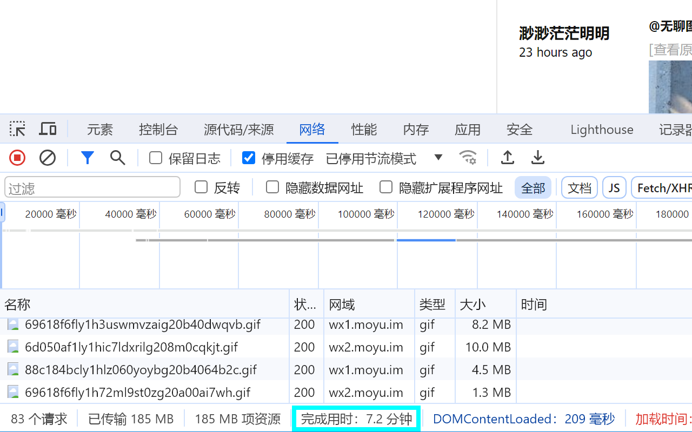
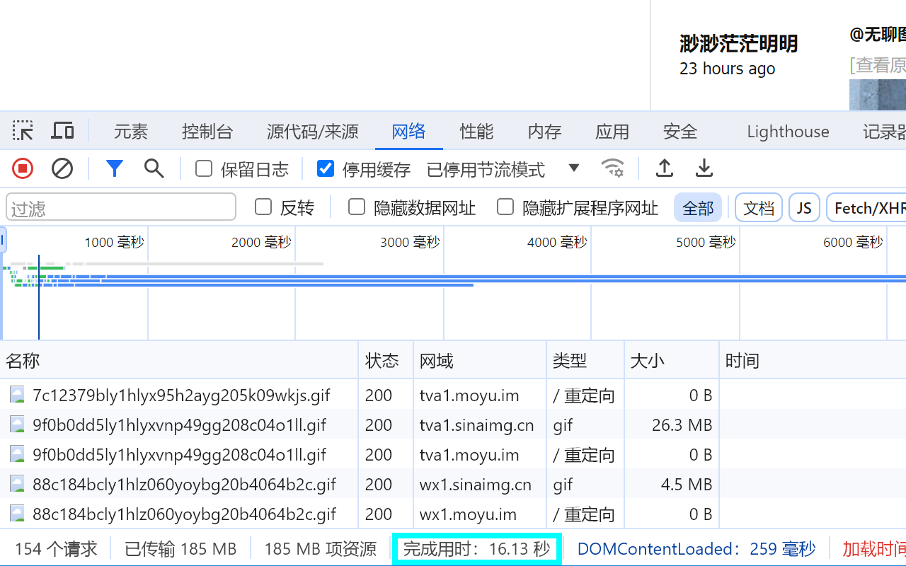
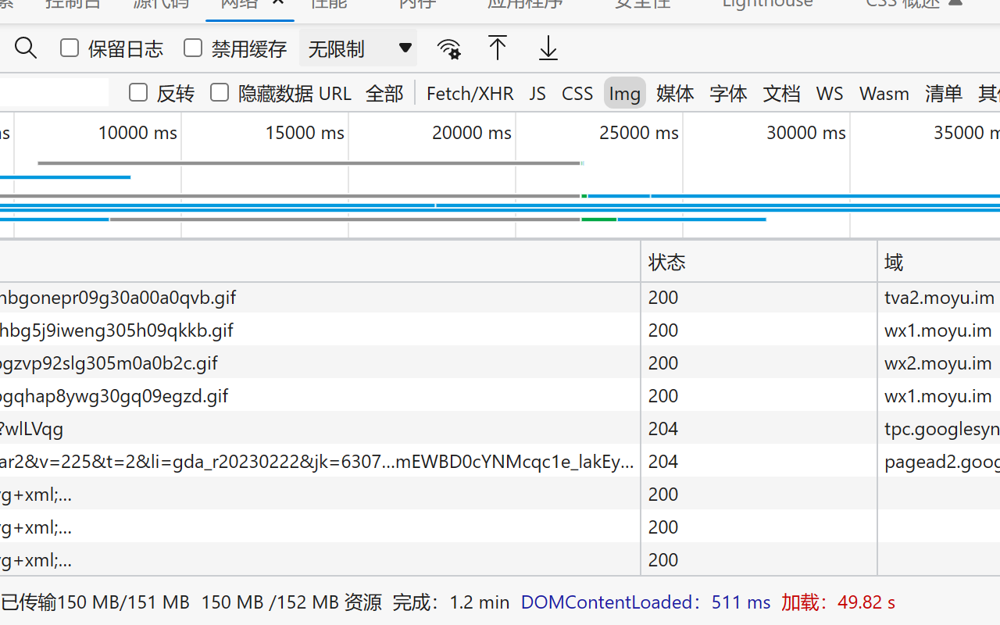
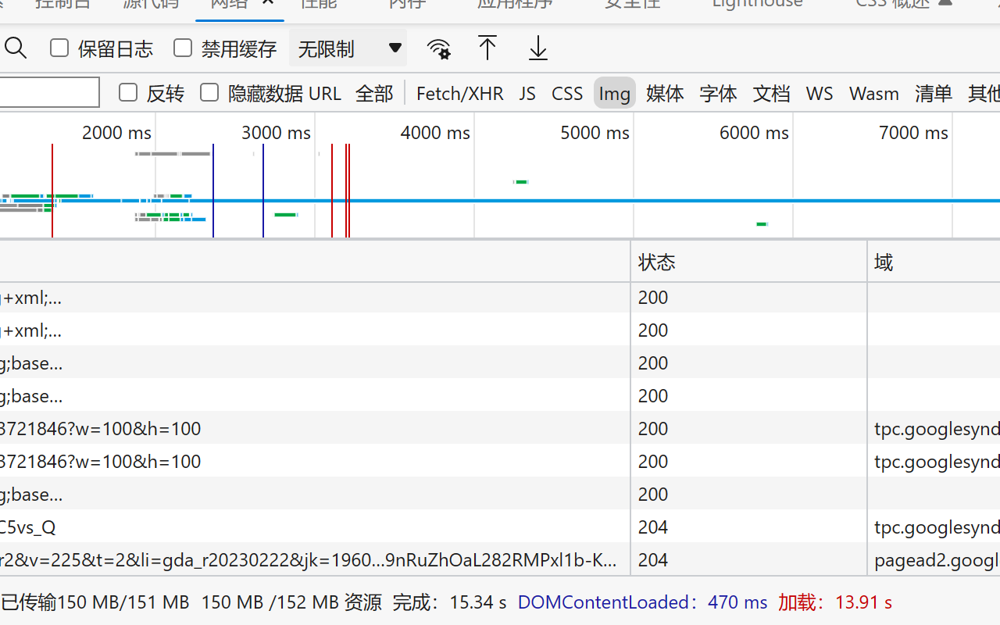

[![Badge Mozilla]][Mozilla]
[![Badge Chrome]][Chrome]
[![Badge Edge]][Edge]

***

<h1 align="center">

煎蛋无聊图加速
</h1>

一个简单的浏览器扩展，替换煎蛋无聊图的图床为原先的新浪图床，加速图片加载。

开箱即用，无需任何设置。

***

## 安装

### Firefox

### Chrome/Edge

### 手动安装

点击展开安装说明

在开始安装之前，请从 [Releases](https://github.com/seiuneko/JandanPicBoost/releases/latest) 页面下载最新版本的扩展文件：

| 浏览器         | 文件名格式   |
|-------------|---------|
| Firefox     | `*.xpi` |
| Chrome/Edge | `*.crx` |

> :warning: **注意** 请务必仅从 GitHub Releases 页面下载扩展文件，以确保安全性。

#### Firefox

1. 在 Firefox 地址栏输入 `about:addons` 并回车
2. 将下载的 `.xpi` 文件拖拽到 Firefox 的 `附加组件管理器` 页面。
3. 在弹出的提示中点击 `添加` 按钮
4. 安装完成

#### Chrome/Edge

1. 在 Chrome/Edge 地址栏输入 `chrome://extensions` 并回车
2. 点击页面上的 `开发者模式` 切换按钮，启用开发者模式
3. 将下载的 `.crx` 文件拖拽到 Chrome/Edge 的 `扩展程序` 页面。
4. 在弹出的提示中点击 `添加扩展程序` 按钮
5. 安装完成

## 使用截图

安装扩展前后：

### Firefox

|                        安装前                        |                       安装后                       |
|:-------------------------------------------------:|:-----------------------------------------------:|
|  |  |

### Chrome

|                       安装前                       |                      安装后                      |
|:-----------------------------------------------:|:---------------------------------------------:|
|  |  |

### Edge

|                     安装前                     |                    安装后                    |
|:-------------------------------------------:|:-----------------------------------------:|
|  |  |

## 友情链接

[SessionPaw🐾](https://sessionpaw.com/): Tree Style Tabs Outliner & Quick Jump to Recent Tabs & Group Tab and Windows &
Tab Session Manager, Lovely and Powerful, a cute browser extension to tame 10,000 tabs 🐈🐾🐾🐾

<!----------------------------------------------------------------------------->

[Mozilla]: https://addons.mozilla.org/zh-CN/firefox/addon/jandanpicboost/

[Chrome]: https://chromewebstore.google.com/detail/pgkhddbbipclegkaheabhpahkifdaane

[Edge]: https://microsoftedge.microsoft.com/addons/detail/cemghbpkkckldmnfchdiflmoeamkimbi

<!----------------------------------[ Badges ]--------------------------------->

[Badge Mozilla]: https://img.shields.io/amo/users/jandanpicboost?logo=firefoxbrowser&label=Firefox%20users

[Badge Chrome]: https://img.shields.io/chrome-web-store/users/pgkhddbbipclegkaheabhpahkifdaane?logo=googlechrome&label=Chrome%20users

[Badge Edge]: https://img.shields.io/badge/dynamic/json?logo=microsoftedge&label=Edge%20users&logoColor=489ee2&color=brightgreen&query=%24.activeInstallCount&url=https%3A%2F%2Fmicrosoftedge.microsoft.com%2Faddons%2Fgetproductdetailsbycrxid%2Fcemghbpkkckldmnfchdiflmoeamkimbi